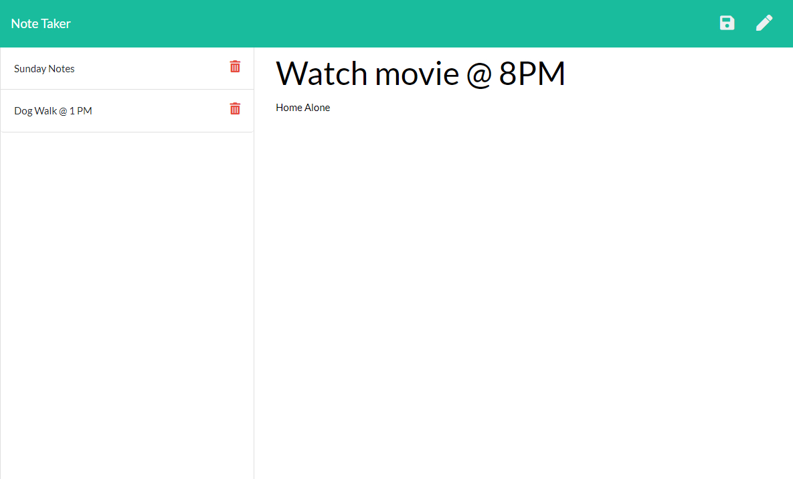

# Challenge 11: The Note Taker

## Description
A website that lets you create and save notes that uses the following:

* Javascript
* HTML
* CSS
* Express
* Node.js

## Screenshot
</img>
                      
## Installation
Navigate to the folder containing server.js and run "npm start" in the terminal.

## Usage
Hosts a website to create and take notes

## Questions
Contact information for questions:  

Github: https://www.github.com/nickus1028  
Email: nick@test.com

